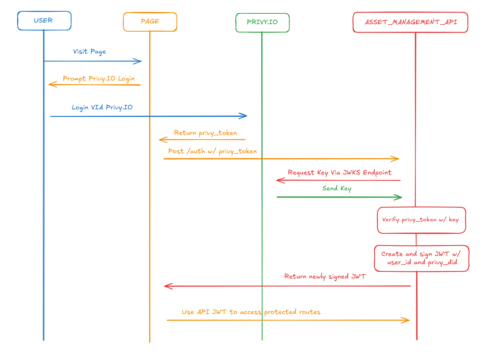

*Trigger Action for Demo PR*

# Asset Management API

This is a demonstration of a Lite Asset Management API the [Lite Asset Management UI](https://github.com/ACatThatPrograms/asset-management-api)
With it's respective respotistory [here]()

A (hopefully) live version of the API docs can be found [here](https://assetapi.acatthatprograms.com/api-docs)

Additionally a (should be) live version of the UI can be found [here](https://cats-asset-management.netlify.app/)

## Quick Start

Ensure docker is installed w/ sudoless mode and the docker compose plugin for the below quick start, start manually via `container/psql/docker-compose.yml` -- Though you will still need the [docker compose plugin](https://docs.docker.com/compose/install/linux/)

1. Run `cp env.example .env` -- And then edit .env to fill in missing fields
2. Open two terminals
4. In Terminal_1 - Run `pnpm i`
3. In Terminal_1 - Run `pnpm db:start`*
4. In Terminal_2 - After docker starts run `pnpm migrate` or `pnpm migrate:clean` if you need to reset DB state to a fresh slate
5. In Terminal_2 - After migration completes run `pnpm start` or `pnpm start:dev` if developing locally and wishing to see changes

You should have two terminals running:

Terminal_1: Running a Postgresql Docker container that has the migrations ran to and is ready to use
Terminal_2: Running the NestJS application in normal or development mode.

***If pnpm refuses to start docker:**

If on linux ensure you have [sudoless](https://docs.docker.com/engine/install/linux-postinstall/) setup 
Alternatively cd into the `containers/psql` directory to run the container manually

## API Documentation

API Docs are available as a swagger doc at `/api-docs` when the API is running.

## Project Setup

This project is built using NestJS w/ TypeScript. 

It uses PostgreSQL for the DB and includes a Docker setup for local development.

A Lite UI using react can be [found here]() to interact with this API

### Prerequisites

- Node.js
- pnpm
- Docker ( For running local containers )
- PostgreSQL ( See notes below )

#### PSQL ( For Local Development )

A quick to start container is included for local development inside `containers/psql/migrations` 

[See the readme](./containers/README.md) inside `containers` for instructions on running & migration

### Environment Variables ( Required )

Create an `.env` file in the root of the project and add the following variables:

- `JWT_SECRET`: Secret key for backend JWT signing
- `PRIVY_APP_ID`: Privy application ID
- `PRIVY_APP_SECRET`: Privy application secret
- `DB_HOST`: Database Host
- `DB_NAME`: Database Name
- `DB_USER`: Database User
- `DB_PASSWORD`: Database User's Password
- `DB_PORT`: Database Port

See .env.example for an example entry with non-private fields already filled

### Running the Application

- Application can be started with `pnpm start:dev`

### Testing

- Unit tests can be ran with: `pnpm run test`

### Linting

Linting checked via workflow action but can also be ran manually via:

`pnpm run lint`, with `:fix` - To attempt fixes and save prettify changes

### Pre-Commit

TODO: Add husky precommit, commit linting & es-linting

## Authentication Architecture

An interactive drawing of the authentication flow can be found [here](https://excalidraw.com/#json=RxuM2kPDIMOfI93c43BDg,0NDyYXMos_bN87QckvseKQ)

Or viewed below at a static image:

